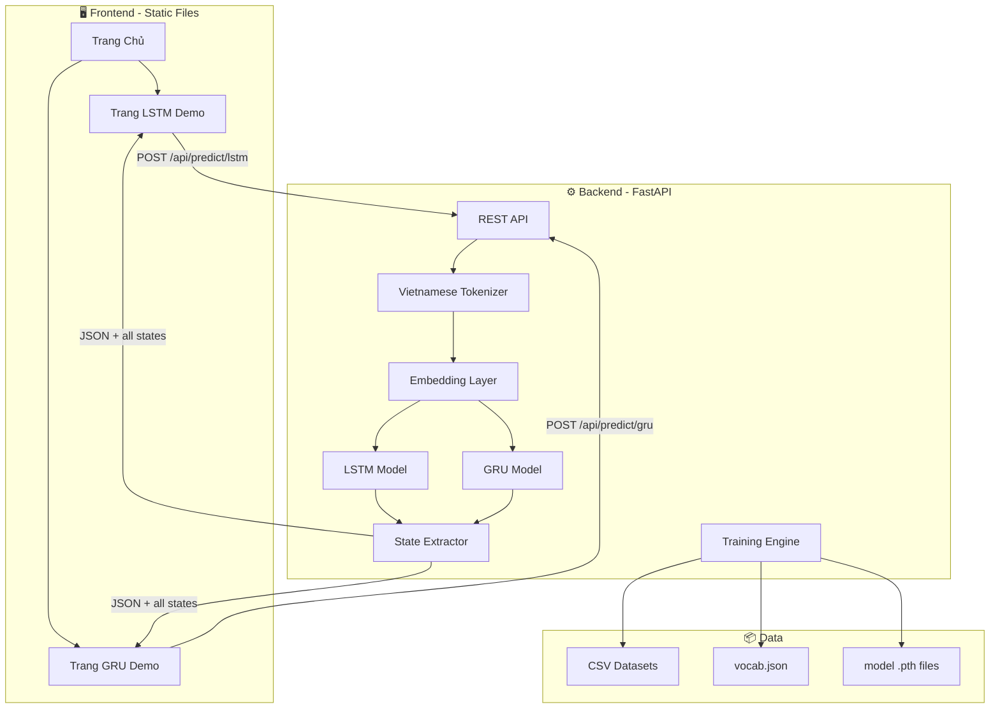
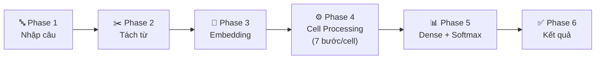
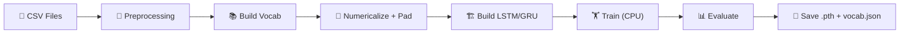

# 🧠 Thiết Kế Hệ Thống Web Demo LSTM & GRU
## Phân Tích Cảm Xúc Feedback Sinh Viên Việt Nam

---

## 1. Tổng Quan Dự Án

### 1.1 Mục Tiêu
Xây dựng web application tương tác với **animation trực quan** giúp người dùng hiểu rõ cách hoạt động bên trong của **LSTM** và **GRU**, thông qua bài toán phân tích cảm xúc (tích cực/tiêu cực) từ feedback sinh viên Việt Nam.

### 1.2 Quyết Định Đã Xác Nhận

| Hạng Mục | Quyết Định |
|----------|-----------|
| Ngôn ngữ giao diện | 🇻🇳 Tiếng Việt |
| Hosting | Local only |
| Model | Train mới hoàn toàn |
| Demo mode | Dùng model đã pre-trained |
| So sánh LSTM vs GRU | Không cần |
| Style cell | Hiện đại, trực quan, dễ hiểu |
| Compute | CPU-focused (máy mạnh CPU) |

---

## 2. Phân Tích Dataset

### 2.1 Thông Tin Dataset

| Tập | File | Số Dòng |
|-----|------|---------|
| Train | `sentiment_data.csv` | 10,968 |
| Test | `sentiment_test.csv` | 3,000 |
| Validation | `sentiment_validation.csv` | 1,511 |

### 2.2 Cấu Trúc Dữ Liệu

```
Columns: [sentence, label, topic]
Encoding: UTF-8 with BOM
```

| Cột | Kiểu | Mô Tả |
|-----|------|--------|
| `sentence` | string | Câu feedback tiếng Việt |
| `label` | int (0/1) | 0 = Tiêu cực, 1 = Tích cực |
| `topic` | int (0-3) | Chủ đề (không dùng cho sentiment) |

### 2.3 Thống Kê

```
Phân bố label (Train):
  - Tích cực (1): 5,643 (51.4%) ✅ Cân bằng tốt
  - Tiêu cực (0): 5,325 (48.6%)

Độ dài câu:
  - Trung bình: ~15 từ / ~60 ký tự
  - Tối đa: 159 từ / 660 ký tự
```

### 2.4 Ví Dụ Dữ Liệu

| Câu | Label |
|-----|-------|
| "slide giáo trình đầy đủ ." | 1 (Tích cực) |
| "nhiệt tình giảng dạy , gần gũi với sinh viên ." | 1 (Tích cực) |
| "chưa áp dụng công nghệ thông tin và các thiết bị hỗ trợ cho việc giảng dạy ." | 0 (Tiêu cực) |
| "thời lượng học quá dài , không đảm bảo tiếp thu hiệu quả ." | 0 (Tiêu cực) |

---

## 3. Công Nghệ Sử Dụng

### 3.1 Stack

```
┌──────────────────────────────────────────────┐
│               FRONTEND                        │
│  HTML5 + CSS3 + Vanilla JavaScript            │
│  ├── SVG (vẽ sơ đồ cell LSTM/GRU)           │
│  ├── GSAP v3 (animation engine)              │
│  └── D3.js v7 (training charts)             │
├──────────────────────────────────────────────┤
│               BACKEND                         │
│  Python FastAPI                               │
│  ├── PyTorch (CPU mode)                      │
│  ├── underthesea (Vietnamese tokenizer)       │
│  └── uvicorn (ASGI server)                   │
├──────────────────────────────────────────────┤
│               DATA                            │
│  ├── CSV datasets (đã có sẵn)               │
│  ├── vocab.json (build từ dataset)           │
│  └── model weights .pth (sau training)       │
└──────────────────────────────────────────────┘
```

### 3.2 Lý Do Chọn

| Thành Phần | Lý Do |
|-----------|-------|
| **Vanilla JS + SVG** | Kiểm soát tuyệt đối animation, SVG cho phép hover/click từng thành phần bên trong cell |
| **GSAP v3** | Animation mượt, timeline control, stagger, easing chuyên nghiệp, miễn phí cho dự án này |
| **FastAPI** | Async, nhanh, auto-docs, tích hợp PyTorch dễ dàng |
| **PyTorch (CPU)** | Phù hợp máy CPU mạnh, dễ trích xuất gate values qua hooks |

---

## 4. Kiến Trúc Hệ Thống

### 4.1 Sơ Đồ Kiến Trúc



### 4.2 Cấu Trúc Thư Mục

```
BCMH_RPL/
├── backend/
│   ├── main.py                     # FastAPI entry point + static file serving
│   ├── config.py                   # Hyperparameters & paths
│   ├── models/
│   │   ├── __init__.py
│   │   ├── lstm_model.py           # LSTM model class
│   │   ├── gru_model.py            # GRU model class
│   │   └── state_extractor.py      # Trích xuất intermediate states
│   ├── training/
│   │   ├── __init__.py
│   │   ├── train.py                # Training script (chạy riêng)
│   │   ├── dataset.py              # PyTorch Dataset class
│   │   └── preprocessor.py         # Vietnamese text preprocessing + vocab
│   ├── api/
│   │   ├── __init__.py
│   │   ├── routes.py               # API endpoints
│   │   └── schemas.py              # Pydantic models
│   └── requirements.txt
│
├── frontend/
│   ├── index.html                  # Trang chủ (chọn LSTM / GRU)
│   ├── lstm.html                   # Trang demo LSTM
│   ├── gru.html                    # Trang demo GRU
│   ├── css/
│   │   ├── global.css              # Design system, variables, fonts
│   │   ├── landing.css             # Landing page styles
│   │   ├── demo.css                # Shared demo page styles
│   │   └── cell.css                # Cell SVG styling & gate colors
│   ├── js/
│   │   ├── core/
│   │   │   ├── api.js              # Fetch wrapper cho backend
│   │   │   ├── animation.js        # GSAP timeline engine
│   │   │   └── utils.js            # Helpers
│   │   ├── components/
│   │   │   ├── inputPanel.js       # Ô nhập + transform animation
│   │   │   ├── tokenDisplay.js     # Hiển thị tokens hàng ngang
│   │   │   ├── embeddingViz.js     # Embedding visualization
│   │   │   ├── cellRenderer.js     # SVG cell renderer (chung)
│   │   │   ├── gateTooltip.js      # Hover tooltip cho gates
│   │   │   ├── miniCellBar.js      # Thanh mini cells bên dưới
│   │   │   ├── outputPanel.js      # Kết quả dự đoán
│   │   │   └── controls.js         # Nút prev/next/play/speed
│   │   ├── lstm/
│   │   │   ├── lstmCell.js         # LSTM cell SVG template + logic
│   │   │   └── lstmFlow.js         # LSTM animation orchestrator
│   │   └── gru/
│   │       ├── gruCell.js          # GRU cell SVG template + logic
│   │       └── gruFlow.js          # GRU animation orchestrator
│   └── libs/                       # Thư viện CDN backup (optional)
│
├── data/
│   ├── sentiment_data.csv          # Training data (đã có)
│   ├── sentiment_test.csv          # Test data (đã có)
│   ├── sentiment_validation.csv    # Validation data (đã có)
│   ├── vocab.json                  # Sẽ được tạo khi train
│   └── checkpoints/
│       ├── lstm_model.pth          # Sẽ được tạo khi train
│       └── gru_model.pth           # Sẽ được tạo khi train
│
└── docs/
    └── design.md
```

---

## 5. Thiết Kế Giao Diện & Animation

### 5.1 Trang Chủ (Landing Page)

```
┌─────────────────────────────────────────────────────────┐
│                                                         │
│         🧠 Demo Mạng Nơ-ron Hồi Quy                   │
│         Phân Tích Cảm Xúc Feedback Sinh Viên            │
│                                                         │
│     ┌──────────────────┐   ┌──────────────────┐         │
│     │                  │   │                  │         │
│     │    ╔═══════╗     │   │    ╔═══════╗     │         │
│     │    ║ LSTM  ║     │   │    ║  GRU  ║     │         │
│     │    ╚═══════╝     │   │    ╚═══════╝     │         │
│     │                  │   │                  │         │
│     │  Long Short-Term │   │  Gated Recurrent │         │
│     │     Memory       │   │      Unit        │         │
│     │                  │   │                  │         │
│     │  3 Gates         │   │  2 Gates         │         │
│     │  Cell + Hidden   │   │  Hidden State    │         │
│     │                  │   │                  │         │
│     │  [ Khám Phá → ]  │   │  [ Khám Phá → ]  │         │
│     └──────────────────┘   └──────────────────┘         │
│                                                         │
│     💡 Nhập một câu feedback → Xem AI xử lý từng bước  │
│                                                         │
└─────────────────────────────────────────────────────────┘

- Background: animated gradient mesh (dark navy → deep purple)
- 2 Cards: glassmorphism, hover scale + glow effect
- Floating particles nhẹ ở background
- Mini SVG preview LSTM cell & GRU cell trong mỗi card
```

---

### 5.2 Tổng Quan Flow Demo (LSTM Page)

6 Phases animation liên tiếp:



---

### 5.3 Phase 1 & 2: Nhập Câu → Tách Từ

**Trạng thái ban đầu:**
```
┌───────────────────────────────────────────────────┐
│                                                   │
│           🧠 LSTM - Phân Tích Cảm Xúc            │
│           Feedback Sinh Viên Việt Nam              │
│                                                   │
│     ┌─────────────────────────────────────┐       │
│     │                                     │       │
│     │  Nhập câu feedback của bạn...       │       │
│     │                                     │       │
│     └─────────────────────────────────────┘       │
│                                                   │
│              [ 🚀 Phân Tích ]                     │
│                                                   │
│  Thử nhanh:                                       │
│  ┌──────────────────────────────────────────┐     │
│  │ "Thầy giảng bài rất dễ hiểu"            │     │
│  │ "Môn học này quá khó và nhàm chán"       │     │
│  │ "Giảng viên nhiệt tình hỗ trợ sinh viên"│     │
│  └──────────────────────────────────────────┘     │
│                                                   │
└───────────────────────────────────────────────────┘
```

**Animation khi bấm "Phân Tích":**
1. Nút ripple effect → loading spinner xuất hiện (gọi API)
2. API trả về → Ô input thu nhỏ, trượt lên góc trên (GSAP `power3.inOut`, 0.8s)
3. Title fade out, layout chuyển sang chế độ demo
4. Các từ đã tokenize xuất hiện từng cái một, xếp hàng ngang:

```
   Sau animation:
   ┌──────────────────────────────────────────────┐
   │ 📝 "thầy giảng bài rất dễ hiểu"    [Nhập lại]│
   ├──────────────────────────────────────────────┤
   │                                              │
   │  ┌─────┐ ┌──────┐ ┌─────┐ ┌─────┐ ┌────┐ ┌─────┐
   │  │thầy │ │giảng │ │ bài │ │ rất │ │ dễ │ │hiểu │
   │  │ T1  │ │  T2  │ │ T3  │ │ T4  │ │ T5 │ │ T6  │
   │  └─────┘ └──────┘ └─────┘ └─────┘ └────┘ └─────┘
   │   stagger animation: mỗi từ xuất hiện cách 0.12s
```

Mỗi token card:
- Background: `rgba(255,255,255,0.06)` + backdrop blur
- Border: `1px solid rgba(255,255,255,0.12)`
- Border-radius: `10px`
- Animation: `scale(0.5) → scale(1)` + `opacity(0→1)` + slight `y(-10→0)`

---

### 5.4 Phase 3: Embedding Visualization

```
   ┌─────┐ ┌──────┐ ┌─────┐ ┌─────┐ ┌────┐ ┌─────┐
   │thầy │ │giảng │ │ bài │ │ rất │ │ dễ │ │hiểu │
   └──┬──┘ └──┬───┘ └──┬──┘ └──┬──┘ └──┬─┘ └──┬──┘
      │       │        │       │       │       │
      ▼       ▼        ▼       ▼       ▼       ▼
   ┌─────┐ ┌──────┐ ┌─────┐ ┌─────┐ ┌────┐ ┌─────┐
   │0.23 │ │0.89  │ │0.12 │ │0.67 │ │0.45│ │0.78 │
   │0.45 │ │-0.12 │ │0.98 │ │0.23 │ │0.67│ │0.34 │
   │ ··· │ │ ···  │ │ ··· │ │ ··· │ │ ···│ │ ··· │
   └─────┘ └──────┘ └─────┘ └─────┘ └────┘ └─────┘
     128d     128d    128d    128d    128d    128d
      ↑
   Click → xem full vector + heatmap
```

**Animation:**
1. Mũi tên SVG draw animation (stroke-dasharray reveal) từ mỗi từ kéo xuống
2. Vector card hiện lên với số "typing" effect (2-3 giá trị + "···")
3. Nhãn "128d" nhỏ bên dưới mỗi vector
4. **Click interaction:** click vector → popup modal:
   - Toàn bộ 128 giá trị
   - Heatmap strip (màu gradient biểu diễn giá trị)
   - Min, Max, Mean statistics

**Màu vector cards:** gradient border dựa trên giá trị mean:
- Mean dương → viền xanh (`#4ECDC4`)
- Mean âm → viền cam (`#FF6B6B`)

---

### 5.5 Phase 4: Cell Processing (PHẦN CHÍNH)

#### 5.5.1 Layout Tổng Thể (Cell Chain V2)

```
┌────────────────────────────────────────────────────────────┐
│ Tokens:  [thầy] [giảng] [bài] [rất] [dễ] [hiểu]          │
│ Vectors: [v1]   [v2]    [v3]  [v4]  [v5] [v6]             │
├────────────────────────────────────────────────────────────┤
│                                                            │
│  ▸ Cell State (C) ━━━━━━━━━━━━━━━━━━━━━━━━━━━━━━━━━▸      │
│                                                            │
│  ┌──────────┐ ┌──────────────────────────────────┐ ┌──────────┐│
│  │ Cell t=2 │ │                                  │ │ Cell t=4 ││
│  │ "giảng"  │ │      LSTM Cell  t = 3            │ │ "rất"    ││
│  │          │ │      (đang xử lý: "bài")        │ │          ││
│  └──────────┘ │                                  │ └──────────┘│
│               │   [Chi tiết cell - mục 5.5.2]    │            │
│               │                                  │            │
│               └──────────────────────────────────┘            │
│                                                            │
│  ▸ Hidden State (h) ━━━━━━━━━━━━━━━━━━━━━━━━━━━━━▸        │
│                                                            │
├────────────────────────────────────────────────────────────┤
│  ◀ Bước Trước  │  Bước 3/7  │  Bước Tiếp ▶  │ ▶▶ Tự Động │
│  Tốc Độ: [🐢 ────●──── 🐇]                                │
└────────────────────────────────────────────────────────────┘
```
**Kiến trúc Layout V2:** Sử dụng Flexbox `justify-content: center` để đảm bảo Cell hiện tại (Active Cell) luôn nằm chính giữa. Các cell đã qua và sắp tới hiển thị dưới dạng thu nhỏ (Miniature) ở hai bên (chain-left, chain-right).

#### 5.5.2 LSTM Cell SVG - Thiết Kế Hiện Đại

> [!IMPORTANT]
> Thiết kế cell hiện đại hơn hình gốc, sử dụng rounded shapes, gradient fills, và glowing effects thay vì đường kẻ đơn giản.

```
┌──────────────────────────────────────────────────────────────────┐
│                        LSTM Cell t                               │
│                                                                  │
│  ════════════════════════════════════════════════════════════     │
│  ║     Cell State C(t-1)                         C(t)       ║    │
│  ║  ━━━━━━━━━━━━━━━▶ [  ×  ] ━━━━━━▶ [  +  ] ━━━┳━━━▶     ║    │
│  ║                     │                │       🔋 (Bar)    ║    │
│  ════════════════════════════════════════════════════════════     │
│                        │                │                        │
│                        │           ┌────┘                        │
│                        │           │                             │
│                        │         [ × ]                           │
│                        │           │                             │
│                   ┌────┴────┐ ┌────┴────┐                        │
│                   │         │ │         │                        │
│  ┌────────────┐  │         │ │         │  ┌────────────┐        │
│  │ ╭────────╮ │  │         │ │         │  │ ╭────────╮ │        │
│  │ │ FORGET │ │  │         │ │         │  │ │ OUTPUT │ │        │
│  │ │  GATE  │ │  │         │ │         │  │ │  GATE  │ │        │
│  │ │  f(t)  │ │  │         │ │         │  │ │  o(t)  │ │        │
│  │ │   σ    │ │  │         │ │         │  │ │   σ    │ │        │
│  │ ╰────────╯ │  │         │ │         │  │ ╰────────╯ │        │
│  │  🟠 0.73   │  │         │ │         │  │  🟣 0.91   │        │
│  └─────┬──────┘  │         │ │         │  └─────┬──────┘        │
│        │         │ ╭──────╮│ │╭──────╮ │        │               │
│        │         │ │INPUT ││ ││CANDI-│ │        │               │
│        │         │ │ GATE ││ ││DATE  │ │        │  ┌─────────┐  │
│        │         │ │ i(t) ││ ││ C̃(t) │ │        │  │  tanh   │  │
│        │         │ │  σ   ││ ││ tanh │ │        │  │   🔵    │  │
│        │         │ ╰──────╯│ │╰──────╯ │        │  └────┬────┘  │
│        │         │ 🟢 0.85 │ │🔵 [vec] │        │       │       │
│        │         └────┬────┘ └────┬────┘        │       │       │
│        │              │           │              │       │       │
│  ══════╧══════════════╧═══════════╧══════════════╧═══════╧═══   │
│  ║  Hidden State h(t-1)                              h(t)   ║   │
│  ║  ━━━━━━━━━━━━━━━━━━━━━━━━━━━━━━━━━━━━━━━▶ [×] ━━━━━▶    ║   │
│  ══════════════════════════════════════════════════════════════   │
│                                                                  │
│        ▲ x(t) input vector                                       │
└──────────────────────────────────────────────────────────────────┘
```

**Đặc điểm thiết kế hiện đại:**

1. **Gate nodes** là rounded rectangle với gradient fill:
   - Forget: gradient `#FF6B6B → #EE5A24` (cam đỏ)
   - Input: gradient `#26de81 → #20bf6b` (xanh lá)
   - Candidate: gradient `#45B7D1 → #4ECDC4` (xanh dương)
   - Output: gradient `#A55EEA → #8854D0` (tím)
   
2. **Đường ống (pipes)**: rounded stroke, gradient khi data chảy qua
   - Default: `#2d3436` (xám tối)
   - Chạy data: glow animation + đổi màu gate tương ứng
   - Particle dots di chuyển dọc theo ống

3. **Operators** (×, +): diamond shape nhỏ, sáng lên khi active

4. **Battery Indicator (Thanh Pin Cell State)**: Hiển thị dung lượng theo % với màu tương ứng để người dùng trực quan hoá trí nhớ dài hạn C(t). Sử dụng hàm sigmoid quy đổi: `sigmoid(val * 10)` để 0.0 bằng 50% (trung tính), dương là xanh, âm là đỏ.

5. **Cell State lane**: thanh ngang đậm phía trên, gradient vàng `#F7D794 → #F19066`

6. **Hidden State lane**: thanh ngang phía dưới, gradient trắng `#DFE6E9 → #B2BEC3`

7. **Glow effects**: khi gate active → box-shadow glow cùng màu gate

#### 5.5.3 Mã Màu Các Thành Phần

| Thành Phần | Màu Chính | Gradient | Ý Nghĩa |
|-----------|-----------|----------|----------|
| **Forget Gate (f)** | 🟠 Cam đỏ | `#FF6B6B → #EE5A24` | "Quên" - cảnh báo nhẹ |
| **Input Gate (i)** | 🟢 Xanh lá | `#26de81 → #20bf6b` | "Nhớ mới" - tích cực |
| **Candidate (C̃)** | 🔵 Xanh dương | `#45B7D1 → #4ECDC4` | "Ứng viên" |
| **Output Gate (o)** | 🟣 Tím | `#A55EEA → #8854D0` | "Xuất ra" |
| **Cell State C** | 🟡 Vàng | `#F7D794 → #F19066` | Trí nhớ dài hạn |
| **Hidden State h** | ⚪ Bạc | `#DFE6E9 → #B2BEC3` | Trí nhớ ngắn hạn |
| **σ (Sigmoid)** | 🔴 Đỏ hồng | `#FF6B6B` | Nén 0→1 |
| **tanh** | 🔵 Xanh | `#45B7D1` | Nén -1→1 |
| **Pipe mặc định** | Xám | `#2d3436` | Chưa có data |
| **Pipe active** | Sáng + glow | Theo màu gate | Đang có data chạy qua |

#### 5.5.4 Animation 7 Bước Trong Mỗi LSTM Cell

Mỗi bước kéo dài khoảng **1.5-2s** (có thể chỉnh speed), giữa các bước có **pause 0.3s**:

---

**🔹 Quá Trình Chuyển Cell (Fly Animation Flow):**
```
Animation (Giữa các cell):
  - Tự động cuộn trang lên Tokens row (để người dùng theo dõi từ tiếp theo).
  - Thẻ Token tương ứng nháy sáng (pulse scale 1.15).
  - Vector của từ xuất hiện ở trị trí bắt đầu.
  - Vector bay chậm rãi (1.8s) xuống thẳng vị trí x(t) trên Cell SVG. 
  - Trang web tự động cuộn (auto-scroll via requestAnimationFrame) bám theo màn hình hiển thị Vector.
  - Flash glow sáng tại vị trí cổng đầu vào x(t).
```

**🔹 Bước 1: Input Đến**
```
Animation:
  - Vector x(t) từ embedding ở trên → particle dot chảy xuống vào cell
  - h(t-1) từ cell trước → particle dot chảy sang phải vào cell
  - Hai dòng gặp nhau → flash effect nhỏ (concat)
  - Label hiện: "Concat [h(t-1), x(t)]"
```

**🔹 Bước 2: Forget Gate** 🟠
```
Animation:
  - Dòng data chạy vào Forget Gate node
  - Node σ sáng lên (scale 1→1.15→1) + glow cam
  - Giá trị f(t) xuất hiện dưới gate: "f(t) = 0.73"
  - Đường ống từ Forget Gate → phép × trên Cell State đổi màu cam
  - Phép × sáng lên
  - Thanh Pin (Battery): Xảy ra hiệu ứng "RÚT ĐIỆN" (Drain ⚡), màu đỏ, tụt %, thể hiện việc thông tin cũ bị lọc bỏ bớt theo trọng số f(t).

Hover trên Forget Gate:
  ┌─────────────────────────────────────────┐
  │ 🟠 Forget Gate (Cổng Quên)             │
  │                                         │
  │ Quyết định giữ lại bao nhiêu           │
  │ thông tin cũ từ Cell State.             │
  │                                         │
  │ f(t) = σ(W_f · [h(t-1), x(t)] + b_f)  │
  │ f(t) = σ(...) = 0.73                   │
  │                                         │
  │ → Giữ lại 73% thông tin cũ             │
  └─────────────────────────────────────────┘
```

**🔹 Bước 3: Input Gate** 🟢
```
Animation:
  - Dòng data chạy vào Input Gate node
  - Node σ sáng lên + glow xanh lá
  - Giá trị i(t) xuất hiện: "i(t) = 0.85"
  - Đường ống đổi màu xanh lá

Hover trên Input Gate:
  ┌─────────────────────────────────────────┐
  │ 🟢 Input Gate (Cổng Nhập)              │
  │                                         │
  │ Quyết định thông tin mới nào            │
  │ sẽ được lưu vào Cell State.             │
  │                                         │
  │ i(t) = σ(W_i · [h(t-1), x(t)] + b_i)  │
  │ i(t) = σ(...) = 0.85                   │
  │                                         │
  │ → Cho phép 85% thông tin mới vào       │
  └─────────────────────────────────────────┘
```

**🔹 Bước 4: Candidate** 🔵
```
Animation:
  - Dòng data chạy vào Candidate node
  - Node tanh sáng lên + glow xanh
  - Vector C̃(t) hiện tóm tắt: "C̃(t) = [0.42, -0.31, ...]"
  - Phép × giữa i(t) và C̃(t): particles nhân
  - Đường ống lên phép + đổi màu xanh

Hover:
  ┌───────────────────────────────────────────┐
  │ 🔵 Candidate (Giá Trị Ứng Viên)         │
  │                                           │
  │ Tạo ra vector thông tin mới              │
  │ có thể thêm vào Cell State.              │
  │                                           │
  │ C̃(t) = tanh(W_C · [h(t-1), x(t)] + b_C) │
  │ C̃(t) = tanh(...) = [0.42, -0.31, ...]    │
  └───────────────────────────────────────────┘
```

**🔹 Bước 5: Cell State Update** 🟡
```
Animation:
  - Hai luồng hội tụ tại phép +:
    • Luồng 1 (cam): f(t) × C(t-1)  →  "quên bớt"
    • Luồng 2 (xanh): i(t) × C̃(t)   →  "nhớ thêm"
  - Phép + sáng lên → Cell State bar "pulse"
  - Thanh Pin (Battery): Xảy ra hiệu ứng "SẠC PIN" (Charge 🔋), màu xanh, tăng %, thể hiện trị nhớ C(t) được cộng thêm thông tin hữu ích mới.
  - Label: "C(t) = f(t)·C(t-1) + i(t)·C̃(t)"

Visual Cell State bar:
  Trước: ░░░░░░▓▓▓▓░░░░░░  (giá trị cũ)
  Sau:   ░░░▓▓▓▓▓▓▓▓▓░░░░  (giá trị mới, animated transition)
```

**🔹 Bước 6: Output Gate** 🟣
```
Animation:
  - Dòng data chạy vào Output Gate
  - Node σ sáng lên + glow tím
  - Giá trị o(t) xuất hiện: "o(t) = 0.91"
  - Đường ống tím sáng lên

Hover:
  ┌─────────────────────────────────────────┐
  │ 🟣 Output Gate (Cổng Xuất)             │
  │                                         │
  │ Quyết định phần nào Cell State          │
  │ sẽ xuất ra thành Hidden State.          │
  │                                         │
  │ o(t) = σ(W_o · [h(t-1), x(t)] + b_o)  │  
  │ o(t) = σ(...) = 0.91                   │
  │                                         │
  │ → Xuất ra 91% thông tin                │
  └─────────────────────────────────────────┘
```

**🔹 Bước 7: Hidden State Output**
```
Animation:
  - Cell State C(t) chảy qua tanh (node sáng lên)
  - tanh(C(t)) × o(t) tại phép × cuối
  - h(t) mới chảy ra sang phải (particle animation)
  - C(t) chảy sang cell tiếp theo (đường trên)
  - h(t) chảy sang cell tiếp theo (đường dưới)
  - Khựng (Delay 2s) để người dùng xem lại. Dòng data hiện rõ ràng các chỉ số đã xử lý.

  Transition sang cell tiếp:
  - Thay đổi vị trí trong "Cell Chain layout". Active Cell trượt sang bên trái tham gia vào nhóm "Miniature đã xử lý". Cell tiếp theo trượt vào trung tâm.
  
  Nếu là cuối cùng → Ngay lập tức cuộn xuống Phase 5.
```

#### 5.5.5 Bị Lược Bỏ (Thay bằng Cell Chain)
Mục Mini Cell Bar dạng bottom tracking đã bị lược bỏ do vấn đề không tiện giao diện và khó quan sát, nay thay bằng Layout Flex-centered trong mục 5.5.1

#### 5.5.6 Controls Panel

```
┌──────────────────────────────────────────────────────┐
│                                                      │
│  ◀ Bước Trước      Bước 3 / 6      Bước Tiếp ▶     │
│                                                      │
│  Tốc Độ: [🐢 ─────────●──── 🐇]   [ ▶▶ Tự Động ]  │
│                  1.5x                                │
│                                                      │
│  Mức chi tiết: ( ● Cơ Bản ) ( ○ Chi Tiết ) ( ○ Nâng Cao ) │
│                                                      │
└──────────────────────────────────────────────────────┘

Cơ Bản:    Chỉ animation flow, ẩn số
Chi Tiết:  Animation + giá trị chính (gate means)
Nâng Cao:  Tất cả phép tính + vector values
```

---

### 5.6 Phase 5 & 6: Dense Layer → Kết Quả

```
┌───────────────────────────────────────────────────┐
│                                                   │
│  h(T) = [0.38, -0.12, ...]                       │
│    │                                              │
│    ▼                                              │
│  ┌─────────────────┐                              │
│  │   Dense Layer    │  W·h(T) + b                 │
│  │   64 → 2         │                             │
│  └────────┬────────┘                              │
│           ▼                                       │
│  ┌─────────────────┐                              │
│  │    Softmax       │  normalize → xác suất       │
│  └────────┬────────┘                              │
│           ▼                                       │
│                                                   │
│  ┌─────────────────────────────────┐              │
│  │                                 │              │
│  │  😊  Tích Cực                   │              │
│  │  ████████████████████░░░  87.3% │  ← fill animation
│  │                                 │              │
│  │  😔  Tiêu Cực                   │              │
│  │  ████░░░░░░░░░░░░░░░░░░  12.7% │  ← fill animation
│  │                                 │              │
│  └─────────────────────────────────┘              │
│                                                   │
│  Kết luận: 😊 Câu này mang sắc thái TÍCH CỰC    │
│                                                   │
│  ┌──────────────┐  ┌──────────────────┐           │
│  │ 🔄 Thử Câu   │  │ 🏠 Về Trang Chủ  │           │
│  │   Khác        │  │                  │           │
│  └──────────────┘  └──────────────────┘           │
│                                                   │
└───────────────────────────────────────────────────┘

Animation:
1. Scroll ngay lập tức xuống Output Section (Phase 5).
2. Thanh Positive đếm count-up animate từ 0% → X% (Thời gian: 800ms).
3. Thanh Negative đếm count-up animate.
4. Scale bounce text Emoji Kết luận. Chờ 600ms, Phát nổ glow (đỏ/xanh tuỳ sentiment) tạo drama.
5. Nếu là Tích Cực → viền glow sáng Xanh. Nếu Tiêu Cực → glow Đỏ.
```

---

## 6. Trang GRU Demo

### 6.1 Khác Biệt So Với LSTM

| Đặc Điểm | LSTM | GRU |
|-----------|------|-----|
| Gates | 3 (Forget, Input, Output) | 2 (Reset, Update) |
| States | Cell State + Hidden State | Chỉ Hidden State |
| Phép tính | Nhiều hơn | Ít hơn, nhanh hơn |
| Animation steps/cell | 7 bước | 5 bước |

### 6.2 GRU Cell Layout (Hiện Đại)

```
┌────────────────────────────────────────────────────────────┐
│                        GRU Cell t                          │
│                                                            │
│  ═══════════════════════════════════════════════════════    │
│  ║  h(t-1) ━━━┳━━━━━━━━▶ [ × ] ━━━▶ [ + ] ━━━▶ h(t) ║   │
│  ║            │          (1-z)        z·h̃         ║      │
│  ═══════════════════════════════════════════════════════    │
│               │                        │                   │
│               │                   ┌────┘                   │
│               │                   │                        │
│  ┌────────────┴────┐  ┌──────────┴──────┐                 │
│  │  ╭────────────╮ │  │  ╭────────────╮ │                 │
│  │  │   RESET    │ │  │  │  UPDATE    │ │                 │
│  │  │   GATE     │ │  │  │   GATE     │ │                 │
│  │  │   r(t) σ   │ │  │  │   z(t) σ   │ │                 │
│  │  ╰────────────╯ │  │  ╰────────────╯ │                 │
│  │   🟠 0.62       │  │   🟣 0.78       │                 │
│  └────────┬────────┘  └────────┬────────┘                 │
│           │                    │                           │
│           │              ┌─────┘                           │
│           │              │                                 │
│           │    ┌─────────┴──────────┐                     │
│           │    │  ╭──────────────╮  │                     │
│           │    │  │  CANDIDATE   │  │                     │
│           │    │  │    h̃(t)      │  │                     │
│           │    │  │   tanh       │  │                     │
│           │    │  ╰──────────────╯  │                     │
│           │    │   🔵 [vector]     │                     │
│           │    └────────┬──────────┘                     │
│           │             │                                 │
│  ═════════╧═════════════╧═══════════════                  │
│  ║  x(t) input ━━━━━━━━━━━━━━━━━━━  ║                   │
│  ═══════════════════════════════════════                  │
│                                                            │
└────────────────────────────────────────────────────────────┘
```

### 6.3 Mã Màu GRU

| Thành Phần | Màu | Gradient |
|-----------|-----|----------|
| **Reset Gate (r)** | 🟠 Cam | `#F39C12 → #E67E22` |
| **Update Gate (z)** | 🟣 Tím | `#9B59B6 → #8E44AD` |
| **Candidate (h̃)** | 🔵 Xanh | `#3498DB → #2980B9` |
| **Hidden State** | ⚪ Bạc | `#ECF0F1 → #BDC3C7` |

### 6.4 Animation GRU (5 Bước)

**Bước 1:** x(t) và h(t-1) concat
**Bước 2:** Reset Gate → r(t) quyết định "reset" bao nhiêu thông tin cũ. Hover: giải thích, công thức, giá trị
**Bước 3:** Update Gate → z(t) quyết định tỷ lệ cũ/mới. Hover: giải thích
**Bước 4:** Candidate → h̃(t) = tanh(W·[r(t)×h(t-1), x(t)] + b)
**Bước 5:** Hidden State → h(t) = (1-z(t))×h(t-1) + z(t)×h̃(t). Bar gradient thay đổi.

---

## 7. Model & Training

### 7.1 Model Architecture

```python
# Cả 2 model đều dùng architecture tương tự
class LSTMSentiment(nn.Module):
    def __init__(self, vocab_size, embed_dim=128, hidden_dim=64, 
                 output_dim=2, n_layers=1, dropout=0.3):
        self.embedding = nn.Embedding(vocab_size, embed_dim, padding_idx=0)
        self.lstm = nn.LSTM(embed_dim, hidden_dim, n_layers, 
                           batch_first=True, dropout=0 if n_layers==1 else dropout)
        self.fc = nn.Linear(hidden_dim, output_dim)
        self.dropout = nn.Dropout(dropout)

class GRUSentiment(nn.Module):
    def __init__(self, vocab_size, embed_dim=128, hidden_dim=64,
                 output_dim=2, n_layers=1, dropout=0.3):
        self.embedding = nn.Embedding(vocab_size, embed_dim, padding_idx=0)
        self.gru = nn.GRU(embed_dim, hidden_dim, n_layers,
                         batch_first=True, dropout=0 if n_layers==1 else dropout)
        self.fc = nn.Linear(hidden_dim, output_dim)
        self.dropout = nn.Dropout(dropout)
```

### 7.2 Hyperparameters

| Parameter | Giá Trị | Lý Do |
|-----------|---------|-------|
| `embed_dim` | 128 | Vừa đủ cho vocab tiếng Việt |
| `hidden_dim` | 64 | Nhỏ → dễ visualize, vẫn đủ accuracy |
| `n_layers` | 1 | Demo 1 layer cho trực quan |
| `dropout` | 0.3 | Chống overfitting |
| `lr` | 0.001 | Adam default |
| `batch_size` | 32 | Cân bằng cho CPU |
| `epochs` | 20 | Đủ converge |
| `max_seq_len` | 50 | Giới hạn (avg ~15 từ, đa số < 50) |
| `min_freq` | 2 | Từ xuất hiện ≥ 2 lần mới vào vocab |

### 7.3 Training Pipeline



**Preprocessing tiếng Việt:**
1. Lowercase
2. Chuẩn hóa Unicode NFC
3. Tách từ bằng `underthesea.word_tokenize()`
4. Build vocabulary (word → index)
5. Numericalize + pad/truncate to `max_seq_len`

### 7.4 State Extractor

> [!IMPORTANT]
> Module cốt lõi — trích xuất **tất cả** giá trị trung gian từ model để animation hiển thị giá trị thực.

Trích xuất cho mỗi timestep:
- `embedding vector` (128 dims)
- `forget_gate values` (64 dims) + mean
- `input_gate values` (64 dims) + mean
- `candidate values` (64 dims) + mean
- `output_gate values` (64 dims) + mean
- `cell_state` (64 dims) + mean
- `hidden_state` (64 dims) + mean
- `formula strings` cho tooltip display

### 7.5 Training Script

Training chạy **riêng biệt** bằng lệnh CLI trước khi demo:

```bash
cd backend
python -m training.train --model lstm --epochs 20
python -m training.train --model gru --epochs 20
```

Output:
- `data/checkpoints/lstm_model.pth`
- `data/checkpoints/gru_model.pth`
- `data/vocab.json`
- Console log: loss/accuracy per epoch

---

## 8. API Design

### 8.1 Endpoints

| Method | Endpoint | Mô Tả |
|--------|----------|--------|
| `POST` | `/api/predict/lstm` | Predict + trích xuất all states LSTM |
| `POST` | `/api/predict/gru` | Predict + trích xuất all states GRU |
| `GET` | `/api/health` | Kiểm tra server/model status |

### 8.2 Request

```json
POST /api/predict/lstm
{
  "text": "thầy giảng bài rất dễ hiểu"
}
```

### 8.3 Response

```json
{
  "input_text": "thầy giảng bài rất dễ hiểu",
  "tokens": ["thầy", "giảng", "bài", "rất", "dễ", "hiểu"],
  
  "prediction": {
    "label": "Tích cực",
    "confidence": 0.873,
    "probabilities": { "positive": 0.873, "negative": 0.127 }
  },
  
  "embeddings": [
    { "token": "thầy", "vector": [0.234, 0.452, ...], "summary": [0.23, 0.45, 0.12] }
  ],
  
  "cell_states": [
    {
      "timestep": 0,
      "token": "thầy",
      "forget_gate": { "mean": 0.73, "values": [...] },
      "input_gate": { "mean": 0.85, "values": [...] },
      "candidate": { "mean": 0.42, "values": [...] },
      "output_gate": { "mean": 0.91, "values": [...] },
      "cell_state": { "mean": 0.56, "values": [...] },
      "hidden_state": { "mean": 0.38, "values": [...] },
      "formulas": {
        "forget": "f(0) = σ(...) = 0.73 → Giữ 73% thông tin cũ",
        "input": "i(0) = σ(...) = 0.85 → Cho 85% thông tin mới",
        "output": "o(0) = σ(...) = 0.91 → Xuất 91%"
      }
    }
  ],
  
  "final_layer": {
    "logits": [1.23, -0.87],
    "softmax": [0.873, 0.127]
  }
}
```

---

## 9. Design System (CSS)

### 9.1 Theme - Dark Modern

```css
:root {
  /* Backgrounds */
  --bg-primary: #0a0a1a;
  --bg-secondary: #12122a;
  --bg-card: rgba(255,255,255,0.05);
  --bg-glass: rgba(255,255,255,0.08);

  /* Text */
  --text-primary: #e8e8f0;
  --text-secondary: #8888aa;
  --text-accent: #6c63ff;

  /* Gates */
  --forget-gate: #FF6B6B;
  --input-gate: #26de81;
  --candidate: #45B7D1;
  --output-gate: #A55EEA;
  --cell-state: #F7D794;
  --hidden-state: #DFE6E9;

  /* Accents */
  --accent-primary: #6c63ff;
  --accent-positive: #26de81;
  --accent-negative: #FF6B6B;

  /* Borders */
  --border-subtle: rgba(255,255,255,0.1);
  --border-active: rgba(108,99,255,0.5);

  /* Shadows */
  --glow-primary: 0 0 20px rgba(108,99,255,0.3);
}
```

### 9.2 Typography

```css
@import url('https://fonts.googleapis.com/css2?family=Inter:wght@300;400;500;600;700&family=JetBrains+Mono:wght@400;500&display=swap');

body { font-family: 'Inter', sans-serif; }
.mono { font-family: 'JetBrains Mono', monospace; }
```

### 9.3 Glassmorphism Cards

```css
.glass-card {
  background: var(--bg-glass);
  backdrop-filter: blur(12px);
  border: 1px solid var(--border-subtle);
  border-radius: 16px;
  box-shadow: 0 8px 32px rgba(0,0,0,0.3);
}
```

---

## 10. Kế Hoạch Triển Khai

### Phase 1: Backend Foundation
- [ ] Preprocessing + Vocabulary builder
- [ ] LSTM & GRU model definitions
- [ ] Training script + chạy train 2 model
- [ ] State Extractor
- [ ] FastAPI server + prediction endpoints
- [ ] Test API hoạt động

### Phase 2: Frontend Foundation
- [ ] Design system CSS (global.css)
- [ ] Landing page (index.html)
- [ ] Demo page layout (lstm.html, gru.html)
- [ ] Input panel component + transform animation

### Phase 3: LSTM Page
- [ ] Token display + embedding visualization
- [ ] LSTM Cell SVG rendering
- [ ] Mini cell bar
- [ ] Controls panel (prev/next/speed)

### Phase 4: LSTM Animations
- [ ] 7-step animation engine với GSAP timeline
- [ ] Gate hover tooltips
- [ ] Pipe color transitions
- [ ] Cell state / hidden state flow
- [ ] Output phase animation

### Phase 5: GRU Page
- [ ] GRU Cell SVG (reuse nhiều component)
- [ ] 5-step GRU animation
- [ ] Gate hover tooltips cho GRU

### Phase 6: Polish
- [ ] Responsive adjustments
- [ ] Speed optimization
- [ ] Kiểm tra toàn bộ flow
- [ ] Sửa lỗi UI/UX

---

## 11. Cách Chạy Local

```bash
# 1. Cài dependencies
cd backend
pip install -r requirements.txt

# 2. Train model (chạy 1 lần)
python -m training.train --model lstm --epochs 20
python -m training.train --model gru --epochs 20

# 3. Chạy server
python main.py
# → Mở http://localhost:8000
```

Server FastAPI sẽ serve cả static files (frontend) + API endpoints.

---

## 12. Redesign V2 — UI/UX Overhaul (2026-04-14)

> [!IMPORTANT]
> Phần này ghi lại toàn bộ thay đổi lớn cho giao diện demo.
> **Áp dụng LSTM trước**, sau đó GRU sẽ theo pattern tương tự.

### 12.1 Quyết Định Thiết Kế

| Câu hỏi | Quyết định |
|----------|-----------|
| Multi-cell layout style | **Miniature** — cell active ở giữa, cells xung quanh thu nhỏ |
| Thứ tự triển khai | LSTM trước → GRU sau |
| Controls panel | Floating, draggable, snap-to-edge, collapsible |
| Keyboard shortcuts | Có (→, ←, Space, A, R, Esc, 1/2/3, +/-) |

### 12.2 Thay đổi #1: Token → Embedding → Cell Flow Animation

**Mô tả**: Sau khi tokens + embeddings hiển thị ở trên, khi bắt đầu xử lý cell:
- **Token hiện tại** bay xuống → nằm **phía trên chính giữa cell** (label lớn)
- **Vector** bay xuống → vào vị trí **x(t)** của cell SVG
- Khi chuyển cell tiếp → token+vector cũ bay ra, cái mới bay xuống
- Back lại cũng replay animation

**Implementation**:
- `lstmDemo.js`: thêm `animateTokenToCell(idx)`, `animateTokenOut(idx)`
- `demo.css`: `.token-flying`, `.vector-flying` classes, `@keyframes flyDown`

### 12.3 Thay đổi #2: Cell State Enhancement

**Mô tả**:
- Cell state lane **đậm hơn** (stroke-width: 5-6) + **"conveyor belt" animation** (stroke-dasharray + dashoffset animation)
- Khi data đi qua × → **sáng rực pulse glow**
- **Thanh pin/battery** bên phải cell SVG: vertical bar hiển thị mức C(t) + giá trị số

**Implementation**:
- `cell.css`: `.cell-state-lane` stroke-width tăng, `@keyframes conveyorBelt` animation
- SVG: thêm `<g id="cell-battery">` với rect fill level + text value
- Animate step 5: battery fill thay đổi smooth

### 12.4 Thay đổi #3: Activation Function Labels

**Mô tả**: σ và tanh trong gate nodes to hơn (16-18px, bold), có background badge pill xung quanh.

**Implementation**:
- Gate SVG: thêm `<rect class="activation-badge">` + text lớn hơn
- `cell.css`: `.activation-badge` styles

### 12.5 Thay đổi #4: Sentence Context Display

**Mô tả**:
- Phía trên cell SVG: hiển thị **toàn bộ câu** inline, từ đang xử lý được **highlight sáng** (border + glow + scale lớn hơn)
- Label "đang xử lý: 'tốt'" → nằm trung tâm, font lớn hơn

**Implementation**:
- `lstm.html`: thêm `.sentence-context` div trong `.cell-main`
- `lstmDemo.js`: `updateSentenceContext(cellIdx)` — render câu với `<span class="ctx-active">` cho từ hiện tại
- `demo.css`: `.sentence-context`, `.ctx-word`, `.ctx-active` styles

### 12.6 Thay đổi #5: Multi-Cell Miniature Chain

**Mô tả**:
- Vùng cell là **carousel horizontal** chứa N miniature cell boxes nối nhau bằng arrows
- Cell active scale 1.0 ở giữa, cells xung quanh scale ~0.35, opacity 0.4
- Cell đầu tiên: h(t-1)=0, C(t-1)=0 hiển thị rõ
- Sau khi hoàn thành cell → animation ném output h(t), C(t) sang cell tiếp → **slide smooth** sang cell kế
- Connector arrows giữa cells hiển thị giá trị h(t), C(t)

**Layout**:
```
[cell₁ mini] → [cell₂ mini] → [CELL₃ ACTIVE ████] → [cell₄ mini] → [cell₅ mini]
         h(t)=0.23           h(t)=0.67
         C(t)=0.45           C(t)=0.89
```

**Implementation**:
- `lstm.html`: `.cell-carousel` > `.cell-track` (flex, transform translateX) > N × `.cell-slide`
- `lstmDemo.js`: `buildCellChain()`, `slideToCellSmooth(idx)`, `animateOutputThrow(fromIdx)`
- `demo.css`: `.cell-carousel` (overflow hidden, perspective), `.cell-slide` (transition transform+opacity+scale), `.cell-connector`

### 12.7 Thay đổi #6: Floating Draggable Controls Panel

**Mô tả**:
- Panel controls trở thành **floating window** (`position: fixed`)
- **Draggable** (mousedown/mousemove/mouseup)
- Khi kéo gần mép → **snap vào edge** + **thu gọn** (chỉ hiện nút ▶ để expand)
- Nút toggle `◁`/`▷` để thu gọn/mở rộng
- Khởi tạo: panel thu gọn bên phải, không che cell
- Hiển thị keyboard shortcut hints

**Implementation**:
- `floatingPanel.js` (new file): class `FloatingPanel` với drag, snap, collapse logic
- `lstm.html`: restructure panel HTML, thêm `.panel-toggle`, `.panel-handle`
- `demo.css`: `.floating-panel`, `.floating-panel.collapsed`, `.floating-panel.snapped-right`

### 12.8 Thay đổi #7: Keyboard Shortcuts

| Phím | Chức năng |
|------|-----------|
| `→` hoặc `Space` | Next step |
| `←` | Previous step |
| `A` | Toggle auto-play |
| `1` / `2` / `3` | Detail: Cơ Bản / Chi Tiết / Nâng Cao |
| `R` | Reset demo |
| `Esc` hoặc `H` | Về trang chủ |
| `+` / `=` | Tăng tốc độ |
| `-` | Giảm tốc độ |

**Implementation**:
- `lstmDemo.js`: `document.addEventListener('keydown', handleKeyboard)`
- `lstm.html`: nút `← Trang Chủ` cố định góc trên trái

### 12.9 Thay đổi #8: Gate Hover Improvements

**Mô tả**:
- Gate values **ẩn hoàn toàn** khi chưa có data flow (text empty cho đến khi step chạy tới)
- Hover tooltip mở rộng: **Tên đầy đủ** + **Giải thích** + **Công thức** + **Giá trị hiện tại** + **Diễn giải** (VD: "→ Giữ 73% thông tin cũ")

**Implementation**:
- SVG gate render: giá trị text empty by default
- `showTooltip()`: enhanced content với computed interpretation

### 12.10 Thứ Tự Triển Khai

```
Phase A: Nhỏ, độc lập
  ✅ A1. Back-to-home button + Keyboard shortcuts
  ✅ A2. Floating controls panel (new file + CSS)

Phase B: Cell internals
  ✅ B1. Sentence context display
  ✅ B2. Cell state enhancement (conveyor + battery)
  ✅ B3. Activation function labels + Gate hover

Phase C: Layout lớn
  ✅ C1. Multi-cell miniature chain (carousel)
  ✅ C2. Token → Cell fly animation

Phase D: GRU (sau khi LSTM hoàn chỉnh)
  ⬜ D1. Apply tương tự cho GRU page
```

### 12.11 Files Liên Quan (LSTM)

| File | Thay đổi |
|------|----------|
| `frontend/lstm.html` | Restructure: back btn, cell-carousel, floating panel, sentence context |
| `frontend/js/lstm/lstmDemo.js` | Major rewrite: cell chain, fly animation, keyboard, enhanced tooltips |
| `frontend/js/core/floatingPanel.js` | **NEW** — drag/snap/collapse logic |
| `frontend/css/demo.css` | Floating panel, carousel, flying tokens, sentence context |
| `frontend/css/cell.css` | Conveyor belt, battery bar, activation badges |

